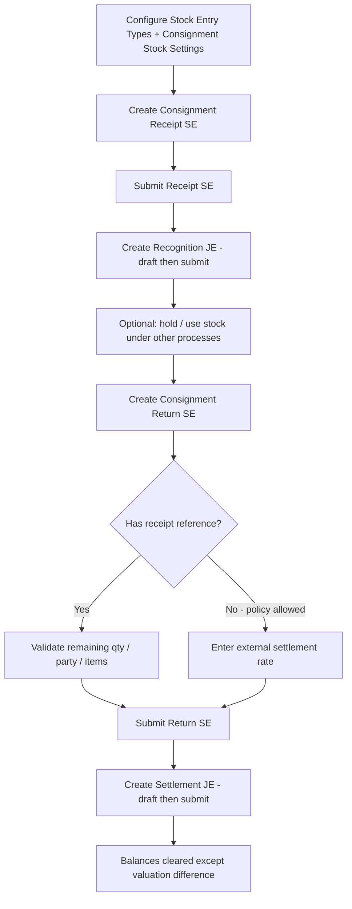

# Consignment Stock — Business Flow

**Application:** `erpnext_extensions`  
**Target release:** `3.8.0`  
**Target ERPNext:** `16.x`  
**Status:** Design only — **no implementation until approval**  
**Date:** 2026-07-31 (revision: approved party + settings + release updates)

---

## 1. Business objective

The company may temporarily receive raw materials from another business party **without purchasing them**.

Materials:

- Are received into a **dedicated consignment warehouse** (inventory account = Consignment Inventory).
- May be held, partially consumed later via other processes, or **returned** to the party.
- Must be **tracked by party**.
- Must carry an **agreed receipt valuation rate** entered at receipt.
- Must support **valuation differences** between the original agreed receipt rate and the warehouse Moving Average rate at return.
- Must create **auditable links** between Stock Entries and related Journal Entries.

Ownership never transfers to the company. The stock is on-hand physically and in perpetual inventory for control, but the economic obligation to the party is recognized separately via Journal Entry.

---

## 2. Actors and documents

| Actor / document | Role |
| --- | --- |
| Consignment Stock User | Creates Consignment Receipt / Return Stock Entries |
| Consignment Accounting User | Creates recognition and settlement Journal Entries |
| Stock Entry Type | Flags `is_consignment_receipt` / `is_consignment_return` |
| Stock Entry (Material Receipt) | Physical + perpetual inventory receipt at agreed rate |
| Journal Entry (Recognition) | Moves Temporary Clearing → Party account |
| Stock Entry (Material Issue) | Physical + perpetual inventory return at warehouse rate |
| Journal Entry (Settlement) | Clears Party vs Temporary Clearing; posts valuation difference |
| Consignment Stock Settings | Per-company accounts and policy flags |

---

## 3. End-to-end happy path



---

## 4. Process steps

### 4.1 Setup (one-time / per company)

1. Create Chart of Accounts (per company):
   - Consignment Inventory (Asset / Stock) — typically linked to the consignment warehouse.
   - Consignment Temporary Clearing (Balance Sheet clearing — not Stock, not P&L).
   - Consignment Valuation Difference (P&L — configured **only** on Consignment Stock Settings, never on Company or Stock Settings).
2. Create / designate a **Consignment Warehouse** whose Warehouse Account is the Consignment Inventory account.
3. Create Stock Entry Types:
   - e.g. `Consignment Receipt` — Purpose `Material Receipt`, `is_consignment_receipt = 1`.
   - e.g. `Consignment Return` — Purpose `Material Issue`, `is_consignment_return = 1`.
4. Configure `Consignment Stock Settings` for the company (required accounts + defaults).
5. Assign roles / permissions.

### 4.2 Consignment receipt

1. User creates Stock Entry with Consignment Receipt type.
2. User selects **Party Type** + **Party** (mandatory Dynamic Link).
3. System validates that the selected party has a **valid accounting flow** for the company (resolvable party account matching Party Type `account_type`).
4. User selects target **consignment warehouse(s)** and items.
5. User enters **manual valuation rate** per row (`basic_rate`); automatic valuation fetch is blocked for this type.
6. System sets / forces **Difference Account** (`expense_account`) to Consignment Temporary Clearing Account.
7. On submit:
   - SLE: stock in at entered rate (Moving Average updates for that warehouse).
   - GL (via standard Material Receipt pairing, constrained accounts):
     - Debit: Consignment Inventory (warehouse account)
     - Credit: Consignment Temporary Clearing
8. Status → `Receipt Submitted` (recognition pending).

### 4.3 Party recognition

1. On submitted receipt, button **Create Consignment Recognition Entry**.
2. System builds a **draft** Journal Entry (default):
   - Debit: Temporary Clearing (receipt amount)
   - Credit: Party account (from `get_party_account(party_type, party, company)`), with `party_type` + `party` on the JE Account row
   - Links: Stock Entry as source; dimensions copied.
3. Accounting user reviews and submits.
4. Status → `Recognized`.
5. Duplicate active (draft or submitted) recognition JE for the same receipt is blocked.

### 4.4 Consignment return (with receipt reference)

**Prerequisite (locked):** each referenced Consignment Receipt must already have a **submitted** Consignment Recognition Journal Entry. Creating or submitting a Consignment Return without this is blocked.

1. User creates Stock Entry with Consignment Return type.
2. Party Type / Party mandatory (must match referenced receipt).
3. User selects eligible receipt(s) **at row level** (header may optionally default).
4. System fetches original receipt rate, remaining returnable qty, batch/serial constraints.
5. User must **not** override outgoing warehouse rate; ERPNext Moving Average / SLE determines issue valuation.
6. System forces Difference Account to Temporary Clearing.
7. Additional Cost rows are not allowed.
8. On submit:
   - SLE: stock out at warehouse valuation rate.
   - GL:
     - Debit: Temporary Clearing (actual outgoing value)
     - Credit: Consignment Inventory
9. Status → `Return Submitted` (settlement pending).

### 4.5 Consignment return (without receipt reference)

**Out of scope for 3.8.0.** Locked decision L1 requires a submitted Recognition JE before any return; recognition is tied to a receipt Stock Entry. Revisit only in a later release with an explicit recognition model for unreferenced returns.

### 4.6 Return settlement

1. Button **Create Consignment Return Settlement** on submitted return.
2. Prerequisites:
   - Recognition JE submitted for every referenced receipt (when references exist), per Settings.
   - No active settlement JE already linked.
3. Draft JE with formula (see accounting matrix):
   - `receipt_settlement_amount` = Σ (return_qty × original_or_external_settlement_rate)
   - `actual_return_valuation_amount` = Stock Entry outgoing value
   - `valuation_difference` = `actual_return_valuation_amount - receipt_settlement_amount`
4. User reviews and submits.
5. Status → `Settled`.

---

## 5. Party handling (approved)

The consignment owner is **not** restricted to Supplier.

Supported owners use ERPNext’s Dynamic Link pattern:

| Field | Type |
| --- | --- |
| Party Type | Link → Party Type |
| Party | Dynamic Link → Party Type |

**Applicable party types** include any Party Type registered in ERPNext for which a valid company party account can be resolved, for example:

- Supplier (typically Payable)
- Customer (typically Receivable)
- Employee / other site-configured Party Types where `account_type` is Payable or Receivable

**Validation (mandatory):**

1. Party Type exists and is an accounting Party Type (`account_type` in Payable / Receivable).
2. Party exists and belongs to that DocType.
3. `erpnext.accounts.party.get_party_account(party_type, party, company)` returns a non-empty account, **or** an explicit party-account override policy is defined and valid.
4. Resolved account’s `account_type` matches Party Type `account_type`.
5. Account belongs to the Stock Entry company, is not a group, and is not disabled.
6. Journal Entry party rules will be satisfiable on recognition/settlement (party_type + party required on Receivable/Payable lines).

Cross-type mismatch examples that must fail: Customer with a Payable-only forced account; missing party account for company; disabled party account.

---

## 6. Partial returns

- One receipt may have many returns over time.
- Remaining returnable qty per receipt row:

```text
remaining = original_receipt_qty_in_stock_uom
            - Σ submitted_return_qty_in_stock_uom (same receipt row)
```

- Cancelled returns are excluded from consumed qty.
- Amended returns: only the current amended submitted document counts; cancelled original does not.

---

## 7. Status model (Stock Entry header)

Proposed stored Select `consignment_status` (only for consignment types):

| Status | Meaning |
| --- | --- |
| `Draft` | Not submitted |
| `Receipt Submitted` | Receipt submitted; recognition missing |
| `Recognized` | Active recognition JE submitted |
| `Partially Returned` | Some qty returned (receipt only) |
| `Fully Returned` | All returnable qty returned |
| `Return Submitted` | Return submitted; settlement missing |
| `Settled` | Settlement JE submitted |
| `Cancelled` | Document cancelled |

---

## 8. Business rules summary

1. Consignment checkboxes only valid for matching Stock Entry Type purposes.
2. Both checkboxes cannot be set on the same type.
3. Consignment transactions require Party Type + Party with valid accounting flow.
4. Receipt rates must be manually entered and > 0 (unless Settings explicitly allow zero — **default deny**).
5. Return outgoing rates are system-driven; user override blocked.
6. Submitted Recognition JE is mandatory before any Consignment Return.
7. Settlement uses original receipt rate for party and actual warehouse value for temporary clearing (`D = A − R`).
8. Additional Cost allocation is forbidden on consignment Stock Entries.
9. Cross-company references blocked.
10. Draft JEs open for review by default; auto-submit only if Settings enable it.
11. Cancellation follows strict dependency order (see solution design).
12. Valuation Difference Account is configured only on Consignment Stock Settings.

---

## 9. Out of scope (v3.8.0)

- Automatic consumption of consigned stock into Manufacture / Work Order with party settlement.
- Multi-currency party settlement beyond company currency (phase 2 unless already required).
- Portal / party self-service.
- Consignment sales (customer-owned finished goods outbound programs) as a separate product — inbound raw-material consignment remains the scope; Customer may still be the **owner party** on inbound receipts.
- Changing Iran Accounting SLE↔GL contract for non-consignment Stock Entries.

---

## 10. Decisions (this revision)

| Topic | Decision |
| --- | --- |
| Release | `erpnext_extensions` **3.8.0** |
| Party types | **Not** Supplier-only; Dynamic Link; any accounting Party Type with valid party account |
| Settings location | Company-specific `Consignment Stock Settings` |
| Valuation Difference Account | On Settings only — **not** Company custom fields, **not** Stock Settings |

All other previously recommended design decisions remain unchanged (see solution design § Approval Decisions).
