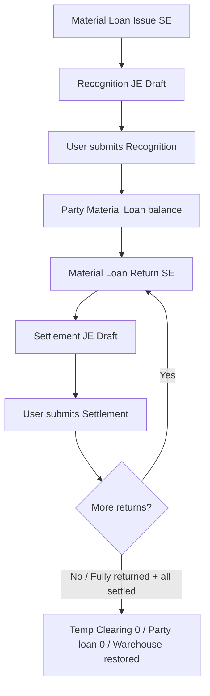

# Material Loan — Business Flow (Revised)

**Application:** `erpnext_extensions`  
**Target release:** `3.8.1`  
**Module:** `consignment_stock` (outbound extension)  
**Status:** Design revised — **awaiting approval of Party account model**  
**Date:** 2026-08-01  

**Supersedes:** Prior “no JE / no Party Ledger” recommendation (rejected).

**Coexistence:** Complements inbound Consignment Stock **3.8.0**. Inbound creates a **party liability** for goods held *for* us. Material Loan creates a **party balance** for *our* materials held by them — via Temporary Clearing + Recognition / Settlement Journal Entries.

---

## 1. Terminology

| Term | Meaning |
| --- | --- |
| **Material Loan** | Outbound program |
| **Material Loan Issue** | Stock Entry (Material Issue) sending company-owned stock to a party |
| **Material Loan Return** | Stock Entry (Material Receipt) receiving loaned stock back |
| **Material Loan Temporary Clearing** | Balance-sheet clearing between Stock Entry and Party JE |
| **Material Loan Party Account** | Dedicated company account mapped per Party Type (not trade Debtors/Creditors defaults) |
| **Material Loan Recognition** | Draft-first JE: Dr Party / Cr Temporary Clearing |
| **Material Loan Return Settlement** | Draft-first JE: Dr Temporary Clearing / Cr Party (± valuation difference if needed) |

Avoid “Outbound Consignment” in UI.

---

## 2. Business scenario

1. Company owns materials in its warehouses.  
2. Materials are temporarily lent to Customer, Supplier, or other accounting Party Type.  
3. Stock leaves the warehouse; **ownership remains with the company**.  
4. Monetary value of materials held by the party must appear on the **Party ledger** (dedicated Material Loan accounts).  
5. Materials are returned (full / partial / multiple); every return row references the original Issue row.  
6. Recognition JE must be submitted before any return.  
7. Each return has its own Settlement JE (draft-first).

Not a trade sale or purchase. Do **not** use default Customer Debtors or Supplier Creditors accounts.

---

## 3. End-to-end flow

---

## 4. Process steps

### 4.1 Setup

1. Configure **Material Loan Temporary Clearing Account**.  
2. Configure **Material Loan Party Account** mapping (Party Type → Account) — see Solution Design.  
3. Optionally configure Valuation Difference Account (recommended for rounding / residual A≠R).  
4. Create Stock Entry Types: Material Loan Issue / Material Loan Return.  
5. Optional default warehouses; Require Expected Return Date; Allow Return to Different Warehouse (default on).

### 4.2 Material Loan Issue

1. Submit Issue SE → stock out; Dr Temporary Clearing / Cr Warehouse (actual SLE valuation).  
2. Freeze per-row issue rate/value from SLE.  
3. Create **Material Loan Recognition** draft JE (button).  
4. User reviews and submits Recognition → Dr Party Material Loan Account / Cr Temporary Clearing.  
5. Until Recognition is submitted: **no Material Loan Return allowed**.

### 4.3 Material Loan Return

1. Every row references Issue + Issue Detail; qty ≤ remaining.  
2. Return at **frozen** original issue rate.  
3. Submit Return SE → Dr Warehouse / Cr Temporary Clearing.  
4. Create **Material Loan Return Settlement** draft JE.  
5. User submits Settlement → clears Party for returned value (and Temp for actual return stock value; Diff if A≠R).

### 4.4 Partial returns

Multiple returns against one Issue; each return has its own Settlement JE. Outstanding qty/value and unsettled Party balance remain reportable.

---

## 5. What is tracked separately

| Dimension | Meaning |
| --- | --- |
| Physical outstanding qty/value | Issued − returned (submitted Returns) |
| Party recognized value | Value on submitted Recognition JE |
| Party settled value | Σ submitted Settlement JE party credits |
| Temporary Clearing balance | SE + JE net (should be 0 after full cycles) |
| Recognition JE status | Missing / Draft / Submitted / Cancelled |
| Settlement JE status (per Return) | Missing / Draft / Submitted / Cancelled |

One status field must **not** hide incomplete accounting.

---

## 6. Out of scope (unchanged)

Consumption, loss, write-off, sale conversion, financial settlement instead of return, item replacement, return without reference.

---

## 7. Compatibility with inbound 3.8.0

| | Inbound Consignment | Material Loan |
| --- | --- | --- |
| Direction | Party goods held by us | Our goods held by party |
| Party JE direction | Credit party (liability) | Debit party (loan balance) then credit on settle |
| Temp clearing | Inbound Temporary Clearing | Material Loan Temporary Clearing (separate account) |
| Fields | `custom_consignment_*` | `custom_material_loan_*` |
| PLE safety | No SE ref on party JE lines | Same rule |

---

## 8. Critical decision (blocking implementation)

**How to represent a Supplier that holds our materials on Party GL** — ERPNext 16 blocks Supplier on Receivable accounts. See Solution Design § Party account model and Final Response.
