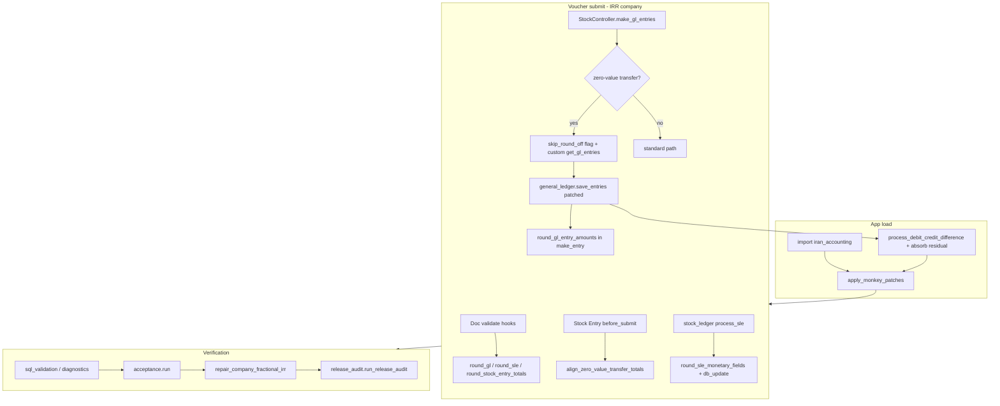

# Iran Accounting — Technical and Functional Documentation

**Module path:** `erpnext_extensions/iran_accounting/`  
**Parent app:** `erpnext_extensions` (ERPNext v15 extensions)  
**Audience:** Technical architects and ERP administrators  
**Source of truth:** This document is derived from the Python/TypeScript sources listed in [Appendix A](#appendix-a-source-file-index). Where behavior is not implemented in code, it is marked **Not implemented**.

---

## 1. Executive Summary

### 1.1 Why `iran_accounting` was created

The module exists to enforce **Iranian Rial (IRR) monetary discipline** on companies whose **default currency is IRR**, while remaining compatible with **foreign-currency (USD/EUR) accounts and transaction currencies** on the same company. The package docstring in `iran_accounting/__init__.py` states: *"Iranian Rial (IRR) accounting and zero-value stock transfer GL corrections."*

### 1.2 Business problem it solves

1. **Fractional rials in the database** — ERPNext’s default currency precision and stock/GL pipelines can persist fractional values in `tabGL Entry`, `tabStock Ledger Entry`, and stock voucher headers even when business policy requires **whole rials** for company-currency amounts.
2. **Noisy GL on internal stock transfers** — For **Material Transfer**, **Material Transfer for Manufacture (MTfM)**, and **Send to Subcontractor** stock entries where **incoming equals outgoing** and **value_difference is zero**, standard ERPNext can post **Stock Adjustment**, **Round Off**, or **doubled inventory GL** legs.
3. **Manufacturing and repost safety** — Work-order-driven MTfM/Manufacture flows must remain GL/SLE-consistent after **Repost Item Valuation** and GLE repost utilities.
4. **Foreign currency on IRR companies** — Purchase/Sales with `update_stock`, USD/EUR party accounts, and transaction currency must keep **IRR company-currency fields integer** while allowing **account-currency decimals** on USD/EUR accounts.

### 1.3 Difference from standard ERPNext behavior

| Area | Standard ERPNext (typical) | `iran_accounting` (IRR company) |
|------|---------------------------|----------------------------------|
| IRR precision | System/Currency precision (often 2+) | `get_currency_precision("IRR")` → **0** (`rounding.py`) |
| GL insert | Field precision from meta | `round_gl_entry_amounts` on validate/before_insert + `general_ledger.make_entry` patch |
| SLE processing | Stock ledger engine precision | `round_sle_monetary_fields` + `reconcile_irr_sle_after_rounding` in hooks and `process_sle` patch |
| Zero-value transfers | Expense bridge + round-off GLE | Custom `StockController.get_gl_entries`, balanced item GL, residual absorption (`zero_value_transfer.py`) |
| Stock Ledger report | Raw query output | Monkey-patched `execute` → `sanitize_stock_ledger_report` |
| Acceptance / release | Not present | `acceptance.run`, `release_audit.run_release_audit`, diagnostics bench APIs |

### 1.4 Main design principles (as implemented)

1. **Company-gated** — Almost all logic runs only when `is_irr_company(company)` is true (`rounding.is_irr_company` → company `default_currency == "IRR"`).
2. **Round at boundaries** — Document hooks (`validate` / `before_insert` / `before_submit`) plus GL engine patches ensure rounding before persistence.
3. **Preserve SLE identity** — After rounding, `reconcile_irr_sle_after_rounding` adjusts integer `valuation_rate` so `stock_value` stays consistent with `qty_after_transaction` where possible.
4. **Prefer absorption over adjustment accounts** — Sub-rial GL imbalance uses `absorb_gl_map_rounding_residual` instead of Round Off when precision is 0 (`monkey_patches._patch_general_ledger`).
5. **Verify in production** — SQL-first checks (`sql_validation.py`), acceptance scenarios 1–39, scenario 999 scoped scan, and full-company `classify_company_fractional_irr` for release.

---

## 2. Architecture Overview

### 2.1 Module components

| Layer | Primary files | Role |
|-------|---------------|------|
| **Bootstrap** | `__init__.py` | Calls `apply_monkey_patches()` on import |
| **Hooks (parent app)** | `erpnext_extensions/hooks.py` | `doc_events`, `after_migrate` |
| **Monkey patches** | `monkey_patches.py` | StockController, StockEntry, `general_ledger`, accounts_controller, stock_ledger engine, Stock Ledger report |
| **Rounding core** | `rounding.py` | Precision, `round_currency`, GL/SLE/STE rounding, SLE reconcile |
| **Document hooks** | `gl_entry.py`, `stock_ledger.py`, `stock_entry.py`, `accounts_invoice.py` | Per-doctype validate/submit |
| **Zero-value GL** | `zero_value_transfer.py` | Transfer GL builder overrides |
| **Validation** | `validation.py`, `sql_validation.py`, `foreign_currency_validation.py` | Fractional detection, zero-transfer shape, FC rules |
| **Preview** | `preview_validation.py` | Desk accounting ledger preview checks |
| **Reports** | `reports.py`, `stock_ledger_report.py` | Sanitized report runners + SL export helpers |
| **Print** | `print_validation.py`, `validation.check_print_html_no_irr_monetary_decimals` | HTML snippet scan |
| **Diagnostics** | `diagnostics.py` | Bench `execute` APIs, normalize/repair, residual checks |
| **Acceptance** | `acceptance.py`, `acceptance_scenarios.py`, `e2e_bootstrap.py` | Scenarios 1–39, 100+, 999 |
| **Release** | `release_audit.py` | `run_release_audit` orchestration |
| **Tests** | `tests/test_*.py` | Unit and integration tests |
| **E2E (optional)** | `e2e/playwright/`, `e2e_playwright.py` | Browser scenario 21 (environment-dependent) |

**Related (parent app, not under `iran_accounting/`):** `stock_reconciliation_precision.py` and `patches/post_model_sync/expand_stock_reconciliation_amount_precision*.py` widen Stock Reconciliation numeric DB columns — supports fractional **input** rates/qty on forms; IRR rounding still applies on posted GL/SLE via hooks/patches.

### 2.2 Startup sequence

1. **Python import of package**  
   - `import erpnext_extensions.iran_accounting` → `iran_accounting/__init__.py` → `apply_monkey_patches()` once (`_PATCHED` guard).

2. **Frappe app load**  
   - `hooks.py` registers `doc_events` for GL Entry, Stock Ledger Entry, Stock Entry, Purchase Invoice, Sales Invoice.

3. **`before_request`**  
   - **Not implemented** for `iran_accounting` (no entry in `hooks.py`).

4. **`after_migrate`**  
   - `erpnext_extensions.iran_accounting.monkey_patches.apply_monkey_patches` re-applies patches after migrate (line 138 in `hooks.py`).

5. **Acceptance / release / diagnostics**  
   - Callers explicitly `import erpnext_extensions.iran_accounting` and/or `apply_monkey_patches()` before exercising ERPNext code paths.

### 2.3 Execution flow (high level)



### 2.4 Monkey patch registration (`monkey_patches.apply_monkey_patches`)

Invokes, in order:

1. `_patch_stock_controller()` — Replaces `StockController` methods from `zero_value_transfer.STOCK_CONTROLLER_METHODS`; wraps `make_gl_entries`, `get_stock_ledger_details`, `get_accounting_ledger_preview`.
2. `_patch_stock_entry()` — `patched_set_total_incoming_outgoing_value`, `before_gl_preview`, wrapped `get_gl_entries` → `finalize_zero_value_transfer_gl_map`.
3. `_patch_general_ledger()` — `merge_similar_entries`, `save_entries`, `process_debit_credit_difference`, `make_entry`, `get_debit_credit_difference`; exposes `absorb_gl_map_rounding_residual`.
4. `_patch_accounts_controller()` — `set_balance_in_account_currency` with account-currency precision.
5. `_patch_stock_ledger_engine()` — `update_entries_after.set_precision`, `process_sle` rounding.
6. `_patch_stock_ledger_report()` — Wraps `erpnext.stock.report.stock_ledger.stock_ledger.execute`.
7. `_patch_accounting_ledger_preview()` — **No-op**; preview wiring lives in `_patch_stock_controller`.

---

## 3. IRR Accounting Rules

### 3.1 Monetary fields — must be integer (IRR company currency)

Defined in `rounding.py`:

**GL Entry (`GL_AMOUNT_FIELDS`):**

- `debit`, `credit`
- `debit_in_account_currency`, `credit_in_account_currency` — rounded with **account currency** precision (IRR account → integer)
- `debit_in_transaction_currency`, `credit_in_transaction_currency` — transaction currency precision
- `debit_in_reporting_currency`, `credit_in_reporting_currency` — reporting currency precision

**Stock Ledger Entry (`SLE_MONETARY_FIELDS`):**

- `stock_value`, `stock_value_difference`, `incoming_rate`, `valuation_rate`

**Stock Entry:**

- Header: `total_incoming_value`, `total_outgoing_value`, `value_difference` (`STOCK_ENTRY_TOTAL_FIELDS`)
- Items: `amount`, `basic_amount` (`STOCK_ENTRY_ITEM_MONETARY_FIELDS`)

**Purchase Invoice / Sales Invoice (IRR base fields)** — `accounts_invoice.py`:

- Header: `base_net_total`, `base_total`, `base_grand_total`, `base_total_taxes_and_charges`, `base_discount_amount`, `base_rounded_total`
- Item: `base_rate`, `base_amount`, `base_net_rate`, `base_net_amount`
- Taxes: `base_tax_amount`

**Reports (IRR company-currency columns):**

- General Ledger via `sanitize_gl_report_row`: `debit`, `credit`, `balance` (`reports.py`)
- Stock Ledger monetary columns via `stock_ledger_report.sanitize_stock_ledger_row` / `STOCK_LEDGER_MONETARY_FIELDNAMES`
- Validation: `assert_report_rows_no_irr_decimals` rejects fractional numerics and decimal strings in configured fields

**Exports:**

- Stock Ledger XLSX: `export_stock_ledger_xlsx_rows` + `fractional_monetary_in_xlsx` (`stock_ledger_report.py`)

**Print:**

- `find_irr_monetary_decimal_snippets` / `_IRR_MONEY_DECIMAL_RE` in `validation.py` — flags comma-grouped or long integers with fractional part in HTML

### 3.2 Quantity fields — remain decimal

**Not** in `SLE_MONETARY_FIELDS`. Examples used in code:

- `actual_qty`, `qty_after_transaction` (`SLE_ROW_FIELDS`, `stock_ledger_report.STOCK_LEDGER_QUANTITY_FIELDNAMES`)
- Stock Entry Detail: `qty`, `transfer_qty` (`sql_validation.sql_get_stock_entry_items`)

**Why:** Iranian practice requires **integer rials** for money; **physical quantity** (including fractional UOM such as kg with decimals) remains a **non-monetary** dimension. Rounding `actual_qty` would break inventory. Acceptance uses `fractional_uom()` and items with decimal qty (e.g. scenario 21 BOM `qty=1.333`).

### 3.3 Detection

- `amount_is_fractional(value, currency)` compares `value` to `round_currency(value, currency)` using currency precision (`rounding.py`).
- IRR: precision 0 → any non-integer monetary amount is fractional.

---

## 4. GL Entry Processing

### 4.1 Document hooks (`gl_entry.py`)

| Hook | Function | Behavior |
|------|----------|----------|
| `validate` | `validate_gl_entry` | If IRR company → `round_gl_entry_amounts(doc)` |
| `before_insert` | `before_insert_gl_entry` | Same as validate |

Registered in `hooks.py` under `"GL Entry"`.

### 4.2 `round_gl_entry_amounts` (`rounding.py`)

For each amount field, uses the currency appropriate to that column:

- Company currency → `debit` / `credit`
- Account currency → `*_in_account_currency`
- Transaction currency → `*_in_transaction_currency`
- Reporting currency → `*_in_reporting_currency`

Rounding uses `round_currency` → half-up to integer for IRR.

### 4.3 General Ledger engine patches (`monkey_patches._patch_general_ledger`)

- **`make_entry`** — Calls `round_gl_entry_amounts(args)` before insert; skips zero debit/credit rows at company precision.
- **`get_debit_credit_difference`** — Rounds each entry before diff calculation.
- **`process_debit_credit_difference`** — For IRR (`precision == 0`):
  - If `|diff| < 1` → `zvt.absorb_gl_map_rounding_residual`
  - Else if Stock Entry with `skip_round_off_for_zero_value_stock_entry` flag → absorb instead of `make_round_off_gle`
  - Else standard round-off GLE path
- **`merge_similar_entries`** — Filters “zero” rows but keeps non-zero account-currency legs for flagged zero-value stock entries.

### 4.4 Accounts controller patch

`set_balance_in_account_currency` — After ERPNext sets balances, fills `debit_in_account_currency` / `credit_in_account_currency` using `get_currency_precision(account_currency)`.

### 4.5 Examples (illustrative)

**IRR GL row (scenario 2 — `s02_gl_rounding`):**

| Field | Before | After `round_gl_entry_amounts` |
|-------|--------|--------------------------------|
| `debit` | 10596667255.68 | 10596667256 |
| `debit_in_account_currency` | 10596667255.68 | 10596667256 |

**USD transaction on IRR company (scenario 10 / FC):**

- `debit` / `credit` in **company currency (IRR)** must be whole rials.
- `debit_in_account_currency` on a **USD account** may retain USD precision (not IRR); `foreign_currency_validation.gl_foreign_currency_violations` only flags IRR account currency fields and company-currency `debit`/`credit`.

**EUR:** Same pattern as USD in scenarios 32, 34, 36 (`foreign_currency_validation.ZERO_DECIMAL_FOREIGN` includes EUR for document total rules; account decimals still governed by account currency precision).

---

## 5. Stock Ledger Processing

### 5.1 Fields

| Field | Role |
|-------|------|
| `stock_value` | Balance value after transaction (company currency) |
| `stock_value_difference` | Movement value for this SLE row |
| `incoming_rate` | Rate on inward movement (monetary per unit in company currency) |
| `valuation_rate` | Valuation rate after transaction |

All four are in `SLE_MONETARY_FIELDS` and rounded to integer rials for IRR companies.

### 5.2 Enforcement paths

1. **Hooks** — `stock_ledger.validate_stock_ledger_entry` / `before_insert_stock_ledger_entry` → `round_sle_monetary_fields`.
2. **Engine patch** — After `process_sle`, IRR companies get `round_sle_monetary_fields` + `frappe.get_doc(sle).db_update()`.
3. **Normalization** — `diagnostics._normalize_irr_voucher_ledgers` re-applies rounding on existing rows (repair/release).

### 5.3 `reconcile_irr_sle_after_rounding` (mathematics)

**Precondition:** `qty_after_transaction` must be present; if missing, function **returns without changes** (scenario 3 fix).

Let:

- `qty_after` = `flt(qty_after_transaction)`
- `after` = `stock_value` (ending balance)
- `diff` = `stock_value_difference`

**If `qty_after == 0`:** Set `valuation_rate = 0`; if `after != 0`, zero out stock_value and set difference to `-before` implied.

**Else:**

1. `target_rate = after / qty_after`
2. Candidate rates: `{int(target_rate), int(target_rate)+1, int(target_rate)-1, round(target_rate)}`
3. Choose `best_rate` minimizing `|after - round_currency(qty_after * r, IRR)|`
4. Set `valuation_rate = round_currency(best_rate, IRR)`

**Example (scenario 3 — `s03_sle_rounding`):**

- Input: `stock_value=1000.68`, `stock_value_difference=-0.68`, no `qty_after` in test dict → reconcile skipped; rounding alone yields `stock_value=1001`, `stock_value_difference=-1` → **PASS**.

**Example (manufacture voucher line — acceptance residual):**

- `qty_after=7.5`, `value_after=92372614`, `valuation_rate=12316348` → `qty_after * rate` may differ by ≤ `max(1, int(|qty_after|)+1)` rials; `check_stock_value_residual` allows this via `rate_product_residual <= max_rate_residual`.

### 5.4 Repost

- `diagnostics.repost_and_check_stock_entry` — Repost Item Valuation (if doctype exists), `repost_gle_for_stock_vouchers`, then `_normalize_irr_stock_entry`.
- `run_repost_for_voucher_impl` — Generic repost + optional normalize (used in acceptance).

Repost can reintroduce fractional SLE; scenario **30** asserts `sql_find_fractional_irr_sle` is empty after normalize + repost on `MAT-STE-2026-00102`.

### 5.5 DB normalization

`_normalize_irr_voucher_ledgers(voucher_type, voucher_no)`:

- Stock Entry: `round_stock_entry_totals` + db_set totals
- All SLE for voucher: `round_sle_monetary_fields` + `db_update`
- All GLE for voucher: `round_gl_entry_amounts` + `db_update`
- Stock Entry: `_sync_bins_from_voucher_sles` (last SLE per item/warehouse; skip if later SLE exists)

---

## 6. Stock Entry Processing

### 6.1 Totals

- `patched_set_total_incoming_outgoing_value` sums item `amount` into incoming/outgoing at company precision, sets `value_difference`.
- `align_zero_value_transfer_totals` — For purposes in `ZERO_VALUE_TRANSFER_STOCK_ENTRY_PURPOSES`, if incoming/outgoing differ by ≤ 1 IRR (precision 0), aligns both to the max and sets `value_difference=0`.

### 6.2 Paths

| Path | Code entry |
|------|------------|
| **Preview** | `before_gl_preview_stock_entry` → calculate amounts, patched totals, align; `get_accounting_ledger_preview` (patched) → `validate_accounting_ledger_preview` |
| **Submit** | `validate_stock_entry`, `before_submit_stock_entry`; `StockController.make_gl_entries` with zero-value branch |
| **Repost** | RIV + GLE repost + `_normalize_irr_stock_entry` |

### 6.3 `check_stock_entry` extra checks

For Stock Entry: GL debit/credit vs `total_incoming_value` / `total_outgoing_value`, no stock adjustment/round-off rows, no doubled GL (`diagnostics.check_voucher`).

---

## 7. Zero Value Transfer Engine

### 7.1 Purposes (`zero_value_transfer.ZERO_VALUE_TRANSFER_STOCK_ENTRY_PURPOSES`)

- Material Transfer  
- Material Transfer for Manufacture  
- Send to Subcontractor  

### 7.2 Original ERPNext behavior (problems addressed)

For internal transfers with **matched incoming/outgoing** and **zero value_difference**, standard `StockController.get_gl_entries` can:

1. Post **per-SLE** inventory and **expense bridge** lines → **doubled GL** vs stock entry totals.
2. Create **Stock Adjustment** or **Round Off** entries for sub-rial imbalance.
3. Show **inflated preview** row counts before `merge_similar_entries`.

### 7.3 `iran_accounting` fixes

1. **`_should_force_balanced_transfer_gl`** — True when purpose in list, `total_incoming_value == total_outgoing_value`, `value_difference == 0`.
2. **`get_gl_entries` override** — If forced balanced: `_append_balanced_transfer_item_gl` (one credit source WH, one debit target WH per item from `amount`) instead of expense-bridge doubling.
3. **`finalize_zero_value_transfer_gl_map`** — Drops zero net Stock Adjustment/Round Off rows; `absorb_gl_map_rounding_residual` on remaining map.
4. **`make_gl_entries` wrapper** — Sets `frappe.flags.skip_round_off_for_zero_value_stock_entry` for balanced transfers.
5. **`save_entries` patch** — Runs finalize before/after `process_debit_credit_difference`.
6. **Preview validation** — `merge_preview_gl_like` by account; 1 IRR tolerance on totals (`preview_validation.validate_accounting_ledger_preview`).

### 7.4 Example (conceptual)

Material Transfer item `amount = 1,000,000` IRR from WH-A to WH-B:

- **Target GL:** Credit inventory A 1,000,000; Debit inventory B 1,000,000; **no** expense account pair; **no** round-off if absorbed.

---

## 8. Manufacturing Flow

### 8.1 Scenarios

| Scenario | Function | Flow |
|----------|----------|------|
| 20 | `s20_work_order_bom` | Create BOM + Work Order |
| 21 | `s21_mtfm` | WO → MTfM Stock Entry: preview → submit → SQL checks → repost |
| 22 | `s22_manufacture` | Manufacture Stock Entry from WO |
| 23 | `s23_manufacture_overhead` | **SKIP** — "operation/overhead not configured on site" |
| 24 | `s24_repost_riv` | Repost on earlier material receipt/transfer ref |

### 8.2 Cost movement (as exercised by acceptance)

1. **RM** — Material receipt / BOM component with fractional qty (`_make_bom_wo`: `qty=1.333`, `rate=50.333`).
2. **WIP** — MTfM moves RM to WIP warehouse (`wo.wip_warehouse` or fallback `to_wh`).
3. **FG** — Manufacture stock entry consumes WIP, produces FG.

### 8.3 Integer IRR interaction

- SLE rates/values rounded on post; `reconcile_irr_sle_after_rounding` picks integer `valuation_rate` per line.
- MTfM is a **zero-value transfer** when totals align → zero-value GL path applies (scenario 21).
- **Scenario 39** validates residual safety on `MAT-STE-2026-00102` (real manufacture) plus synthetic MTfM/Manufacture refs.

---

## 9. Foreign Currency Logic

### 9.1 Scope

`foreign_currency_validation.py` — IRR **company** with transaction currency **USD** or **EUR** (scenarios 31–38). Bootstrap: `e2e_bootstrap.ensure_foreign_currency_acceptance_masters` creates suppliers/customers `IA-FC-ACC-SUP-{USD,EUR}`, `IA-FC-ACC-CUS-{USD,EUR}`.

### 9.2 Rules (implemented)

| Rule | Implementation |
|------|----------------|
| IRR `debit`/`credit` on GL | Must be integer (`gl_foreign_currency_violations` rule `irr_company_gl`) |
| IRR `*_in_account_currency` on IRR accounts | Must be integer (`irr_account_currency_gl`) |
| USD/EUR `*_in_account_currency` on matching accounts | Decimals **allowed** (`foreign_decimal_gl_samples`; not counted as FAIL in company scan when `account_currency` in USD/EUR) |
| PI/SI `base_*` totals | Integer IRR (`document_totals_violations`) |
| Reports/export for voucher | `report_export_ok_for_voucher` |

### 9.3 Scenarios 31–38

| # | Area | DocType | Currency |
|---|------|---------|----------|
| 31 | USD PI update_stock | Purchase Invoice | USD |
| 32 | EUR PI update_stock | Purchase Invoice | EUR |
| 33 | USD Purchase Receipt | Purchase Receipt | USD |
| 34 | EUR Purchase Receipt | Purchase Receipt | EUR |
| 35 | USD SI update_stock | Sales Invoice | USD |
| 36 | EUR SI update_stock | Sales Invoice | EUR |
| 37 | FC repost | Multiple from `ctx.refs` | USD/EUR |
| 38 | FC report/export | GL + SL + XLSX per FC voucher | USD/EUR |

Validation entry: `validate_foreign_currency_voucher` → `compact_evidence` in scenario rows.

### 9.4 IRR supplier/customer for scenarios 6–14

`_irr_supplier` / `_irr_customer` exclude names like `IA-FC-ACC%` so FC bootstrap parties do not break pure-IRR scenarios.

---

## 10. Reports

### 10.1 General Ledger

- **Desk report execute:** **Not monkey-patched globally.**
- **Sanitized runner:** `reports.run_general_ledger_report` → original `execute` then `sanitize_gl_report_row` per row.
- **Used by:** `diagnostics.assert_reports_no_fractional_irr`, `foreign_currency_validation`, acceptance scenarios 25/38.

### 10.2 Stock Ledger

- **Monkey patch:** `stock_ledger.execute` wrapped → `sanitize_stock_ledger_report` (`monkey_patches._patch_stock_ledger_report`).
- **Helpers:** `stock_ledger_report.py` — column classification, `fractional_cells_in_report_rows`, XLSX export via `query_report.run`.

### 10.3 Stock Balance

- **Not implemented** — No patch or sanitizer in `iran_accounting` for Stock Balance report.

### 10.4 Statement of Accounts

- `reports.run_statement_of_accounts_report` calls General Ledger `execute` **without** IRR sanitization wrapper in `reports.py`.
- Test `test_reports_print_repost.test_statement_of_accounts_no_irr_decimals` exists; production Desk path may differ.

### 10.5 Sanitization summary

| Channel | Mechanism |
|---------|-----------|
| Report rows | `round_currency` on monetary columns for IRR company |
| Export | XLSX scan `fractional_monetary_in_xlsx` |
| Print | Regex on HTML `find_irr_monetary_decimal_snippets` |

---

## 11. Diagnostics Framework

All commands are invoked via:

```bash
bench --site <site> execute erpnext_extensions.iran_accounting.<module>.<function> --kwargs '{...}'
```

**Important:** `bench execute` kwargs are evaluated as **Python literals** (`True`/`False`, not JSON `true`/`false`).

### 11.1 `check_stock_entry` / voucher check family

| API | Purpose |
|-----|---------|
| `check_stock_entry(voucher_no)` | Full `check_voucher` for Stock Entry |
| `check_purchase_receipt`, `check_purchase_invoice`, `check_sales_invoice`, `check_delivery_note`, `check_stock_reconciliation` | Same for respective doctypes |
| `check_any_voucher(doctype, voucher_no)` | Generic wrapper |

**Inputs:** Voucher name (string or dict with `voucher_no`).  
**Outputs:** `summarize_voucher_check` structure: `status`, `checks` (`no_fractional_gl`, `no_fractional_sle`, …), fractional field lists, STE totals/GL totals for Stock Entry.  
**PASS:** `status == "PASS"` and all checks true for IRR company.  
**FAIL:** Any fractional IRR GL/SLE or failed STE GL alignment checks.

### 11.2 `repost_and_check_stock_entry(voucher_no)`

**Purpose:** Repost valuation + GLE for one Stock Entry, normalize IRR amounts, return `check_stock_entry` result.  
**Outputs:** Adds `repost_actions` list (RIV name, GLE repost, normalize steps, or failure messages).  
**PASS:** Final `check_stock_entry.status == "PASS"`.

### 11.3 `check_stock_ledger_report(company, voucher_no, from_date, to_date, voucher_type)`

**Purpose:** DB SLE snapshot + sanitized Stock Ledger report + XLSX export fractional scan.  
**PASS:** `db_ok and report_ok and export_ok` (no fractional IRR in DB value/rate fields, report cells, export cells).  
**Note:** Prints diagnostic summary to stdout.

### 11.4 `check_stock_value_residual(voucher_no, company)`

**Purpose:** Per-SLE identity and bin alignment for a Stock Entry; GL totals vs STE header.  
**PASS criteria per line:**

- `identity_residual == 0` (`value_after == round(value_before + movement_value)`)
- Not `orphan_value` (`qty_after==0` implies `value_after==0`)
- Bin matches last SLE when no later activity
- `rate_product_residual <= max(1, int(|qty_after|)+1)`

**Overall PASS:** All lines PASS and `voucher_gl_ok` (balanced GL matching incoming/outgoing).

### 11.5 `check_company_fractional_irr(company, limit, legacy_before)`

**Purpose:** Whitelist wrapper → `classify_company_fractional_irr`.  
**Default `legacy_before`:** `"2026-06-20"`.  
**Outputs:** Buckets `FAIL_NEW_IRR_FRACTIONAL`, `LEGACY_REPOST_REQUIRED`, `ALLOWED_FC_DECIMAL`, `counts`, `fail_new_voucher_keys`.  
**PASS:** `status == "PASS"` ⇔ `fail_new_irr_fractional` count 0.

**Classification logic:**

- GL: each `GL_AMOUNT_FIELDS` fractional per `currency_for_gl_field`; USD/EUR account currency on `*_in_account_currency` → `ALLOWED_FC_DECIMAL`; IRR currency + posting_date ≥ legacy → `FAIL_NEW`; &lt; legacy → `LEGACY_REPOST_REQUIRED`
- SLE: `fractional_sle_fields` with same date split
- Stock Entry headers: fractional totals on post-cutoff → `FAIL_NEW`

### 11.6 `repair_company_fractional_irr(company, legacy_before, max_passes)`

**Purpose:** Loop: classify → `_normalize_irr_voucher_ledgers` per failing voucher → `repost_and_check_stock_entry` for Stock Entries → commit.  
**PASS:** Returns final classify with `fail_new_irr_fractional == 0` (or best effort after `max_passes`).

### 11.7 `release_audit.run_release_audit`

See [Section 13](#13-release-audit).

### 11.8 Additional whitelisted APIs (reference)

| Function | Purpose |
|----------|---------|
| `run_repost_for_voucher(doctype, voucher_no)` | Repost + normalize |
| `assert_no_fractional_irr_gl_api` / `assert_no_fractional_irr_sle_api` | Boolean API wrappers |
| `assert_zero_value_transfer_gl_shape_api` | Zero-transfer GL shape |
| `assert_reports_no_fractional_irr` | GL + SL report window |
| `assert_print_no_fractional_irr` | Print HTML scan; may return `MANUAL_REQUIRED` |
| `check_print_output` | Raw print check |
| `debug_mtfm` | Ad-hoc MTfM trace dump |

---

## 12. Acceptance Framework

**Entry:** `acceptance.run(company, stock_entry_vouchers, include_synthetic, run_repost, scenario_count)`  
**Scenario cap:** `run_scenarios` runs `SCENARIO_FUNCS` while `no <= min(scenario_count, 39)`.  
**Synthetic gate:** If `include_synthetic=False`, scenarios with `no > 3` are skipped.

**Extra scenarios:**

- **100+** — `run_real_stock_entries` for each configured production voucher (pre-check + repost).
- **999** — `check_fractional_for_vouchers` on scoped acceptance vouchers, else `check_company_fractional_irr(limit=30)`.

### 12.1 Scenarios 1–39 (by group)

#### Settings / unit behavior

| # | Function | Purpose | Expected |
|---|----------|---------|----------|
| 1 | `s01_settings` | Company currency IRR; `get_currency_precision("IRR")==0` | PASS if IRR + precision 0 |
| 2 | `s02_gl_rounding` | In-memory GL round | PASS if debit rounds 10596667255.68 → 10596667256 |
| 3 | `s03_sle_rounding` | In-memory SLE round | PASS if 1000.68/-0.68 → 1001/-1 |

#### Inventory / opening

| # | Function | Purpose | Expected |
|---|----------|---------|----------|
| 4 | `s04_opening_sr` | Opening Stock Reconciliation | Submitted SR; `_row_from_voucher` GL/SLE integer |
| 5 | `s05_opening_mr` | Material Receipt opening | Same |
| 15 | `s15_material_transfer` | Material Transfer | Zero-value path; no bad GL |
| 16 | `s16_material_transfer_frac` | Transfer with fractional qty/rate | PASS after rounding |
| 17 | `s17_material_issue` | Material Issue | PASS |
| 18 | `s18_material_receipt` | Material Receipt | PASS |
| 19 | `s19_stock_reco_adj` | Stock Reconciliation adjustment | PASS |

#### Buying / selling (IRR)

| # | Function | Purpose | Expected |
|---|----------|---------|----------|
| 6 | `s06_pr_simple_ma` | Two PRs moving average | PASS or SKIP if PO helpers fail |
| 7 | `s07_pr_fractional` | PR fractional rate | PASS |
| 8 | `s08_pi_irr_stock` | PI IRR update_stock | PASS |
| 9 | `s09_pi_irr_no_stock` | PI IRR expense | PASS |
| 10 | `s10_pi_usd` | PI USD (non-stock path in scenario) | IRR GL fields OK |
| 11 | `s11_si_irr_stock` | SI IRR update_stock | PASS or SKIP (no customer) |
| 12 | `s12_si_irr_no_stock` | SI IRR service | PASS or SKIP |
| 13 | `s13_si_usd` | **SKIP** — USD receivable not configured | SKIP |
| 14 | `s14_delivery_note` | Delivery Note | PASS or SKIP |

#### Manufacturing

| # | Function | Purpose | Expected |
|---|----------|---------|----------|
| 20 | `s20_work_order_bom` | BOM + WO exist | PASS |
| 21 | `s21_mtfm` | MTfM preview/submit/SQL/repost | PASS on SQL + preview gates |
| 22 | `s22_manufacture` | Manufacture entry | PASS |
| 23 | `s23_manufacture_overhead` | Overhead | **SKIP** |

#### Accounting / reports / preview

| # | Function | Purpose | Expected |
|---|----------|---------|----------|
| 24 | `s24_repost_riv` | Repost earlier voucher | PASS if repost_ok |
| 25 | `s25_gl_report` | `assert_reports_no_fractional_irr` GL portion | PASS |
| 26 | `s26_sl_report` | Same for Stock Ledger | PASS |
| 27 | `s27_preview` | Accounting ledger preview totals | PASS |
| 28 | `s28_print` | Print HTML | PASS, FAIL, or **MANUAL_REQUIRED** |

#### Repost / strict DB / production voucher

| # | Function | Purpose | Expected |
|---|----------|---------|----------|
| 29 | `s29_stock_ledger_report_export` | `MAT-STE-2026-00102` report+export | PASS if on site |
| 30 | `s30_strict_sle_db_rates` | Strict SLE integer after normalize+repost | PASS |
| 100+ | `run_real_stock_entries` | Configured STE list | Pre + repost rows |

#### Foreign currency (31–38)

Documented in [Section 9.3](#93-scenarios-3138).

#### Residual safety

| # | Function | Purpose | Expected |
|---|----------|---------|----------|
| 39 | `s39_stock_value_residual_safety` | `check_stock_value_residual` on `MAT-STE-2026-00102` + synthetic STEs | PASS; movement_vs_balance may be ±1 IRR with note |

#### Company scan

| # | Function | Purpose | Expected |
|---|----------|---------|----------|
| 999 | (in `acceptance.run`) | Scoped fractional scan | PASS if no scoped `fail_new_irr_fractional` |

### 12.2 `production_safe` (`acceptance._production_safe`)

Returns **`YES`** only if:

- Scenario **39** PASS with db/gl/sle flags not false  
- Scenario **30** PASS with db/report/export/repost_ok  
- Scenario **21** PASS  
- Scenarios **31–38** none FAIL  
- Overall acceptance **PASS**  
- Print scenarios may be `MANUAL_REQUIRED` → **`YES except print manual validation`**

---

## 13. Release Audit

### 13.1 `run_release_audit(company, stock_entry_vouchers, include_synthetic, run_repost)`

**Sequence:**

1. `acceptance.run` with `scenario_count=39`, default blocker voucher `MAT-STE-2026-00102` if list empty.
2. `check_stock_value_residual(blocker, company)`
3. `repair_company_fractional_irr(company)` — post-acceptance cleanup
4. `classify_company_fractional_irr(company)` — full company scan

### 13.2 `release_ready`

**`YES`** iff all true:

- `acceptance.status == "PASS"`
- `production_safe` starts with `"YES"`
- `blocker_residual.status == "PASS"`
- Gates: s21, s30, s39 **PASS**; s31–38 none **FAIL**; s999 **PASS**
- `FAIL_NEW_IRR_FRACTIONAL == 0` (full company scan count)

### 13.3 Bucket definitions (company scan)

| Bucket | Meaning |
|--------|---------|
| **FAIL_NEW_IRR_FRACTIONAL** | IRR monetary fraction on GL/SLE/STE with `posting_date >= legacy_before` (default 2026-06-20) |
| **LEGACY_REPOST_REQUIRED** | Same violations with `posting_date < legacy_before` |
| **ALLOWED_FC_DECIMAL** | Fractional `debit_in_account_currency` / `credit_in_account_currency` where `account_currency` is USD or EUR |

---

## 14. Database Impact

| Table | Fields touched by logic | Why | Expected (IRR company) |
|-------|-------------------------|-----|------------------------|
| `tabGL Entry` | All `GL_AMOUNT_FIELDS` | Hooks + `make_entry` patch | Integer IRR in company and IRR account columns; FC account columns per account currency |
| `tabStock Ledger Entry` | `SLE_MONETARY_FIELDS` | Hooks + engine patch + normalize | Integer monetary fields; qty fields unchanged |
| `tabStock Entry` | `total_incoming_value`, `total_outgoing_value`, `value_difference` | validate/submit/patched setter | Integers |
| `tabStock Entry Detail` | `amount`, `basic_amount` | `round_stock_entry_totals` | Integers |
| `tabBin` | `actual_qty`, `stock_value`, `valuation_rate` | `_sync_bins_from_voucher_sles` after normalize | Aligned to last voucher SLE when safe |
| `tabPurchase Invoice` / `tabSales Invoice` | `base_*` fields, item `base_*` | `round_irr_invoice_totals` | Integer base amounts |

**Stock Reconciliation DB width:** Parent app patches expand DECIMAL precision for reconciliation forms (`stock_reconciliation_precision.py`); posted GL/SLE still subject to IRR rounding rules.

**Tables not directly written by module code:** Work Order, BOM, Repost Item Valuation (created by repost utilities).

---

## 15. Risks and Trade-offs

### 15.1 `valuation_rate` rounding

Choosing integer rate to minimize `|stock_value - qty * rate|` can leave **rate_product_residual** up to `|qty_after|+1` rials (`check_stock_value_residual`). This is **accepted** by design.

### 15.2 Moving average / FIFO

Module does not replace ERPNext valuation method; it **rounds outputs** of the engine. Cumulative tiny floats may be **absorbed** into GL legs or corrected on **repost/normalize**.

### 15.3 Repost

Repost Item Valuation and `repost_gle_for_stock_vouchers` may fail if Accounts Settings disallow Stock Entry repost (messages captured in `repost_actions`). Scenario 30 and production audit expect normalize to recover integer SLE.

### 15.4 Manufacturing

Fractional BOM/component qty is allowed; monetary amounts are integerized. Scenario 23 (overhead) is **not** validated.

### 15.5 Acceptance side effects

Synthetic scenarios **create real documents** on the site. `repair_company_fractional_irr` after audit fixes post-acceptance fractional rows but **does not delete** test vouchers.

### 15.6 Known limitations

- No global Stock Balance report sanitization.  
- Statement of Accounts runner does not apply `sanitize_gl_report_row`.  
- `before_request` hook not used.  
- Playwright E2E (`e2e/playwright/tests/scenario21.spec.ts`) depends on `FRAPPE_E2E_BASE_URL` / site reachability — not part of `release_ready`.  
- Company fractional scan is **full table read** for GL/SLE/STE — may be heavy on very large sites.  
- `LEGACY_REPOST_REQUIRED` is informational; no automatic legacy repost job in module.

---

## 16. Deployment Guide

### 16.1 Installation

1. Install `erpnext_extensions` on bench alongside ERPNext v15.
2. `bench --site <site> install-app erpnext_extensions` (if not already).
3. Ensure company `default_currency` is **IRR** for targeted companies.

### 16.2 Migrate / restart

```bash
bench --site <site> migrate
bench restart
```

`after_migrate` re-applies monkey patches.

### 16.3 Verification commands

```bash
# Full acceptance (39 scenarios + real STE + 999)
bench --site <site> execute erpnext_extensions.iran_accounting.acceptance.run \
  --kwargs '{"company":"ESPAD","include_synthetic":True,"run_repost":True,"scenario_count":39,"stock_entry_vouchers":["MAT-STE-2026-00102"]}'

# Release audit
bench --site <site> execute erpnext_extensions.iran_accounting.release_audit.run_release_audit \
  --kwargs '{"company":"ESPAD","stock_entry_vouchers":["MAT-STE-2026-00102"],"include_synthetic":True,"run_repost":True}'

# Company fractional buckets
bench --site <site> execute erpnext_extensions.iran_accounting.diagnostics.check_company_fractional_irr \
  --kwargs '{"company":"ESPAD"}'

# Unit tests
cd apps/erpnext_extensions && python -m pytest erpnext_extensions/iran_accounting/tests/
```

### 16.4 Perpetual inventory

`acceptance.run` calls `e2e_bootstrap.enable_perpetual_inventory(company)` — required for stock GL scenarios.

---

## 17. Rollback Guide

### 17.1 Disable document hooks

Remove or comment `doc_events` entries for GL Entry, Stock Ledger Entry, Stock Entry, Purchase Invoice, Sales Invoice in `erpnext_extensions/hooks.py`; migrate/restart.

**Effect:** No validate-time rounding on those doctypes; monkey patches may still run.

### 17.2 Disable monkey patches

1. Remove `apply_monkey_patches` from `iran_accounting/__init__.py` import side effect.  
2. Remove `after_migrate` entry for `apply_monkey_patches`.  
3. Restart workers.

**Effect:** Stock transfer GL reverts toward ERPNext default; Stock Ledger report sanitization off; GL `make_entry` rounding off.

**Caution:** Patches mutate class methods in-process; **restart is required** to restore original ERPNext behavior fully.

### 17.3 Data rollback

Module does not provide down-migration. Restoring integer-normalized GL/SLE from backup is the safe rollback for data. `repair_company_fractional_irr` is forward-fix only.

### 17.4 Uninstall app

Standard Frappe uninstall of `erpnext_extensions` removes hooks; historical GL/SLE values remain as last written.

---

## 18. Future Roadmap

**Not implemented in code** — plausible extensions aligned with `get_currency_precision` / `is_zero_decimal_currency`:

- **IQD**, **AFN**, other zero-decimal currencies — extend `is_irr_currency` or generalize to `is_zero_decimal_currency` company policy.  
- Scheduled **legacy repost** job for `LEGACY_REPOST_REQUIRED` bucket.  
- Stock Balance / Statement of Accounts sanitization patches parity with Stock Ledger.  
- Optional **exclude test voucher prefixes** (`IA-TEST`, `IA-FC-ACC`) from production company scan.

---

## 19. Final Summary

### What the module changes

- Enforces **integer IRR** on configured monetary fields for IRR companies through hooks, GL engine patches, stock ledger engine patches, and stock entry total logic.  
- Replaces zero-value **transfer GL** behavior for three Stock Entry purposes to eliminate adjustment/round-off noise and doubling.  
- Sanitizes **Stock Ledger** report output; provides **sanitized GL runner** for diagnostics.  
- Provides **acceptance**, **diagnostics**, and **release audit** tooling with explicit PASS/FAIL criteria.

### What it does not change

- Non-IRR companies (no `is_irr_company` → hooks no-op).  
- Quantity UOM decimals, item master, tax template math before base rounding on invoices.  
- ERPNext core valuation method selection (MA/FIFO).  
- Stock Balance / SOA Desk reports (no patch).  
- Automatic deletion of acceptance test data.

### Release readiness

On a validated site, **`release_ready == "YES"`** requires acceptance PASS, `production_safe` YES, blocker residual PASS, critical gates (21, 30, 39, 31–38, 999), and **`FAIL_NEW_IRR_FRACTIONAL == 0`** after `repair_company_fractional_irr`.

### Production recommendations

1. Run `run_release_audit` on staging with production-like `stock_entry_vouchers`.  
2. Keep `run_repost=True` until RIV/GLE repost paths are verified.  
3. Treat `MANUAL_REQUIRED` print scenarios as human review, per `production_safe` wording.  
4. Schedule periodic `check_company_fractional_irr` after major upgrades or bulk reposts.  
5. Use Python `True`/`False` in all `bench execute --kwargs` for this module.

---

## Appendix A — Source file index

| File | Responsibility |
|------|----------------|
| `__init__.py` | Patch bootstrap |
| `monkey_patches.py` | ERPNext class/function overrides |
| `rounding.py` | Precision and rounding primitives |
| `gl_entry.py`, `stock_ledger.py`, `stock_entry.py` | Doc hooks |
| `accounts_invoice.py` | PI/SI base rounding |
| `zero_value_transfer.py` | Transfer GL engine |
| `validation.py` | Shared validation helpers |
| `sql_validation.py` | SQL fractional checks |
| `foreign_currency_validation.py` | FC scenario validation |
| `preview_validation.py` | Ledger preview |
| `reports.py`, `stock_ledger_report.py` | Report/export |
| `print_validation.py` | Print wrappers |
| `diagnostics.py` | Bench diagnostics |
| `acceptance.py`, `acceptance_scenarios.py` | Acceptance |
| `e2e_bootstrap.py` | Test data helpers |
| `release_audit.py` | Release orchestration |
| `e2e_playwright.py`, `e2e/playwright/*` | Optional UI tests |
| `tests/*` | Automated tests |
| `../hooks.py` | Frappe integration |

---

## Appendix B — `bench execute` quick reference

| Callable | Module path |
|----------|-------------|
| `run` | `erpnext_extensions.iran_accounting.acceptance.run` |
| `run_release_audit` | `erpnext_extensions.iran_accounting.release_audit.run_release_audit` |
| `check_stock_entry` | `erpnext_extensions.iran_accounting.diagnostics.check_stock_entry` |
| `repost_and_check_stock_entry` | `erpnext_extensions.iran_accounting.diagnostics.repost_and_check_stock_entry` |
| `check_stock_ledger_report` | `erpnext_extensions.iran_accounting.diagnostics.check_stock_ledger_report` |
| `check_stock_value_residual` | `erpnext_extensions.iran_accounting.diagnostics.check_stock_value_residual` |
| `check_company_fractional_irr` | `erpnext_extensions.iran_accounting.diagnostics.check_company_fractional_irr` |
| `repair_company_fractional_irr` | `erpnext_extensions.iran_accounting.diagnostics.repair_company_fractional_irr` |

---

*Document generated from module source in `erpnext_extensions/iran_accounting`. For behavioral changes, diff this package against your deployed tag.*
